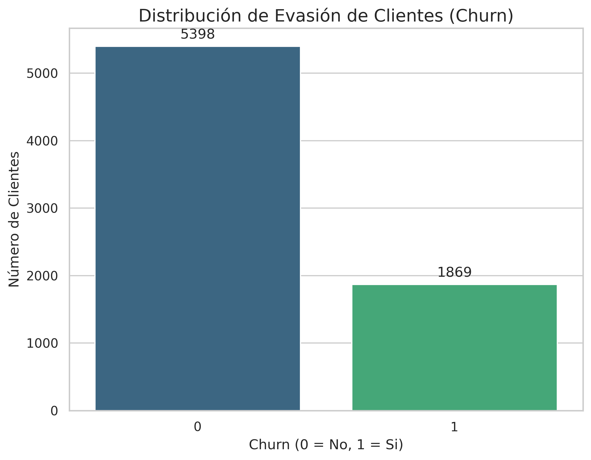
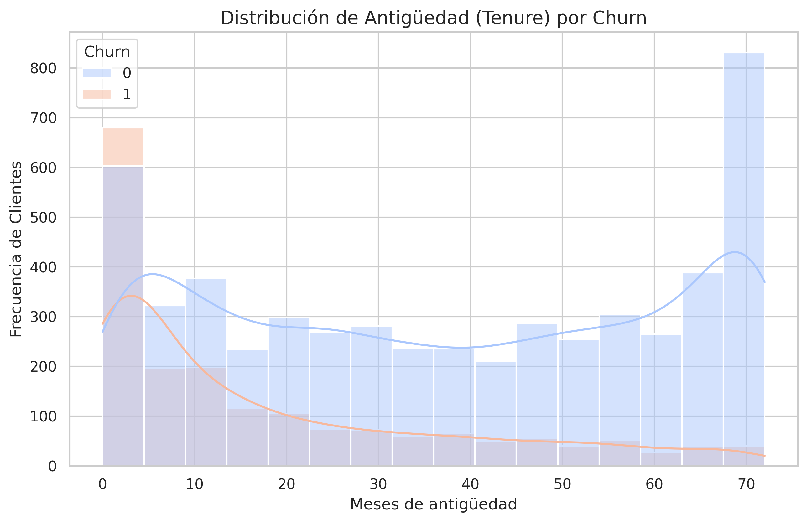
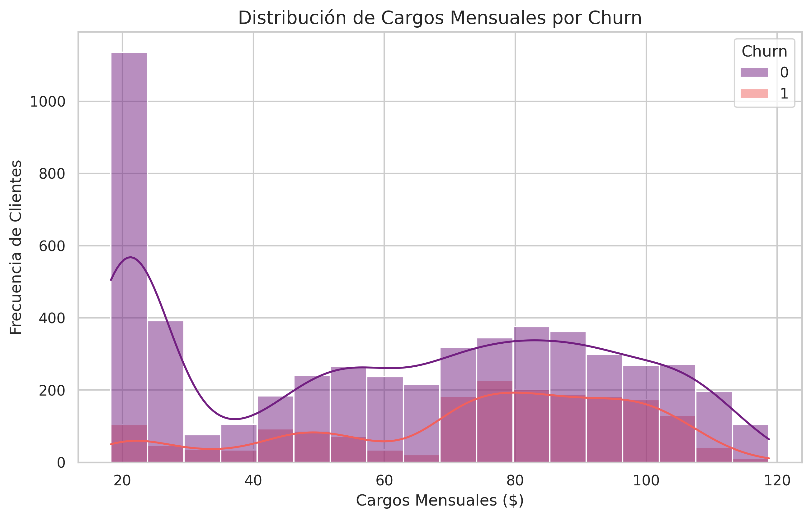
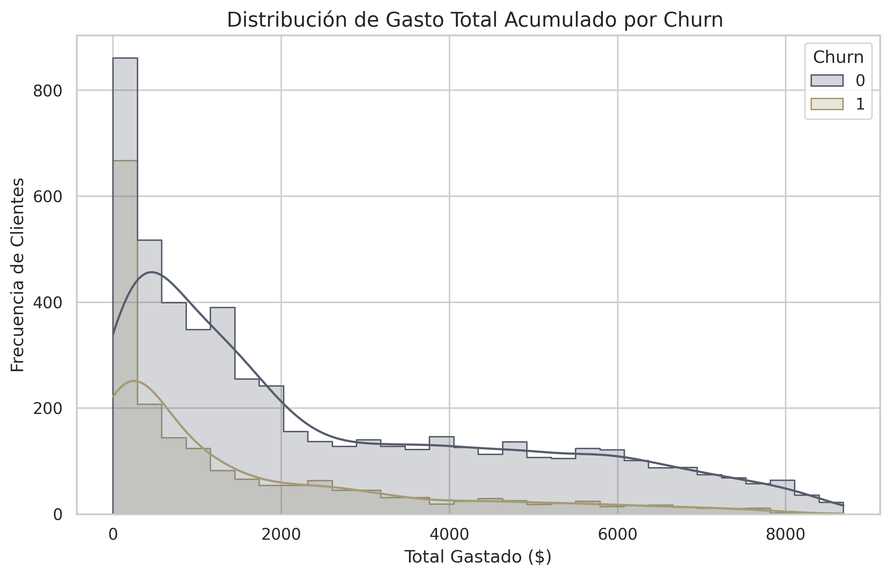
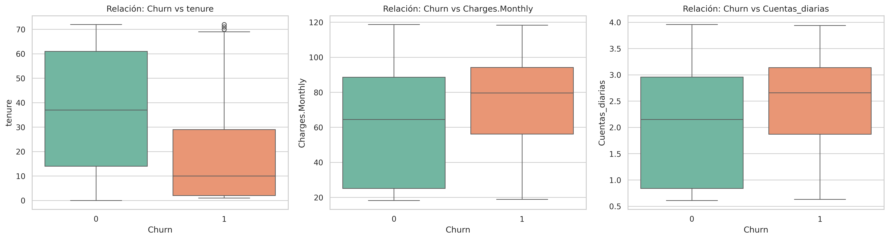
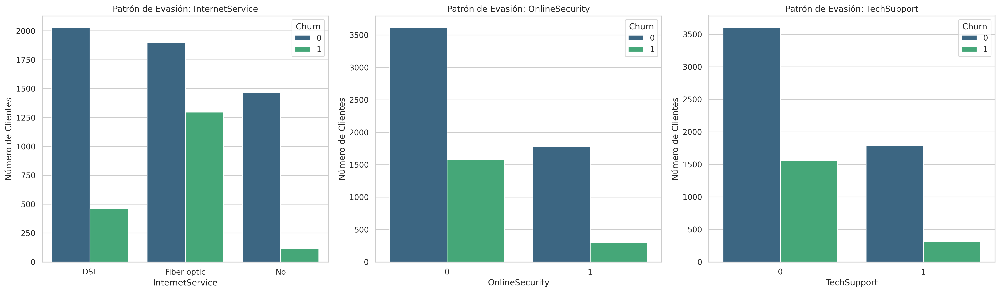
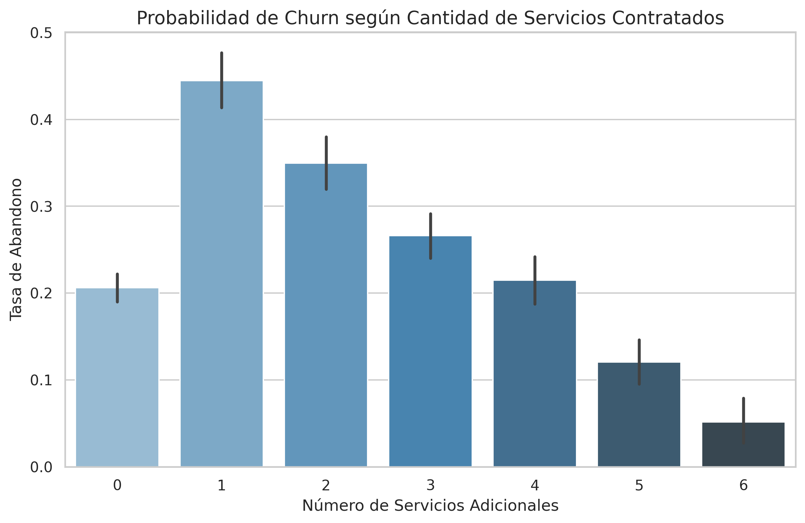
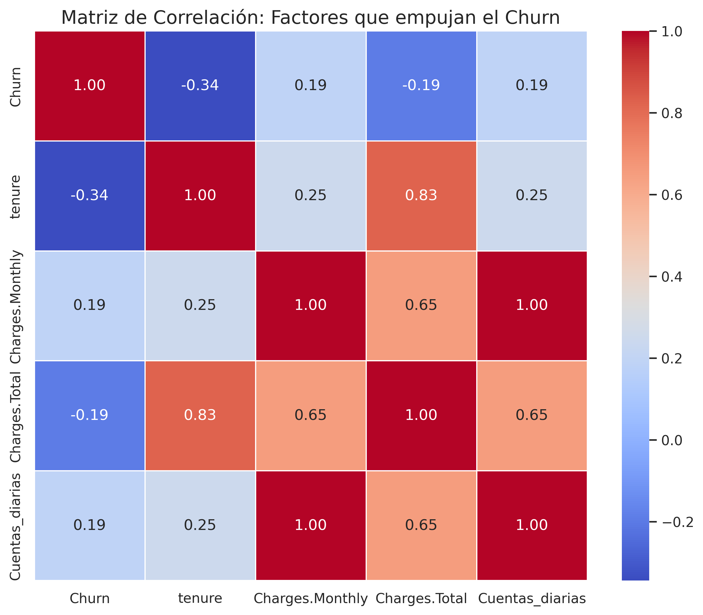
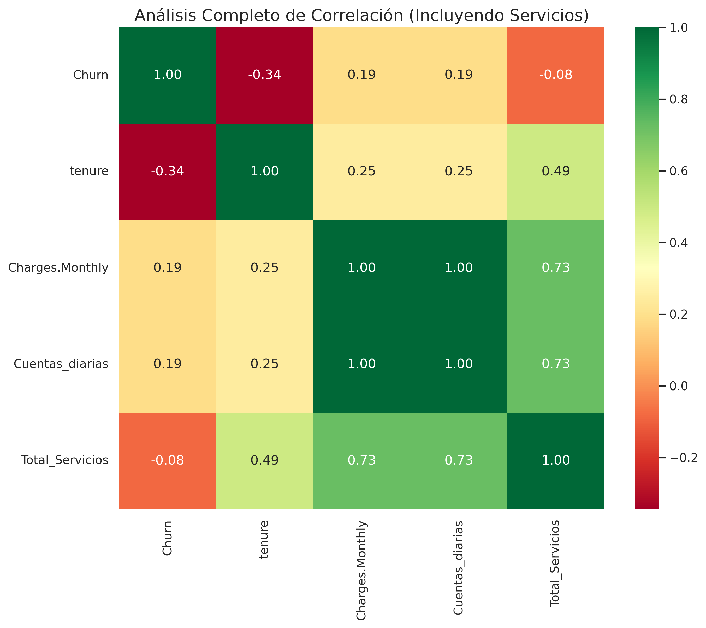

# **Challenge Telecom X: Análisis de Evasión de Clientes**

Este es mi proyecto para el desafío de **Telecom X**. Aquí analicé por qué los clientes cancelan sus servicios (Churn) y qué patrones podemos encontrar en los datos para ayudar a retenerlos.

## **Objetivo del Proyecto**
El objetivo principal fue explorar un dataset de telecomunicaciones para identificar los factores financieros y de servicio que influyen en la decisión de los clientes de irse o quedarse en la compañía.

## Herramientas utilizadas
* **Python** 
* **Pandas**: Para la limpieza y el procesamiento (ETL).
* **Seaborn y Matplotlib**: Para crear todas las visualizaciones.

---

## **Visualizaciones y Hallazgos**

### **1. Evasión de clientes**
Primero toca observar la proporción general. Hay una base sólida, pero la cantidad de clientes que se van (1,869 clientes) es lo suficientemente grande como para prestarle atención.

### **2. Factores de Tiempo y Dinero**
Se observa que los clientes nuevos son los que más se van (en los primeros 5 meses). También noté que los que pagan más de $80 al mes tienen más probabilidad de cancelar.

| Antigüedad (Tenure) | Cargos Mensuales | Gasto Total |
|---|---|---|
|  |  |  |

### **3. Comparación Directa (Boxplots)**
En estos gráficos se ve claro: los clientes que se van (`Churn 1`) suelen tener menos meses en la empresa y cuentas diarias más altas.

### **4. Variables Categóricas y Servicios**
Se analizó el género, el tipo de contrato y el método de pago. El contrato **"Month-to-month"** y el pago con **"Electronic Check"** son los puntos más críticos de evasión.

También se revisaron los servicios técnicos. Tener **TechSupport** o **OnlineSecurity** ayuda muchísimo a que el cliente no se vaya

### **5. Los servicios adicionales**
Prueba extra: ¿qué pasa si un cliente tiene muchos servicios contratados? La respuesta es: **entre más servicios tienen, menos se van.**

### **6. Matriz de Correlación**
Finalmente, se realizaron estas matrices para confirmar que la antigüedad (`tenure`) es lo que más se relaciona de manera negativa con la evasión.

---

## **Conclusiones**
* **Los primeros meses son clave:** Si se pudiera lograr que el cliente pase los primeros 6 meses, es muy probable que se quede mucho tiempo.
* **Servicios ancla:** Hay que promover que los clientes contraten seguridad o soporte técnico, porque eso ayuda a que se mantengan fieles.
* **Contratos:** Los contratos mensuales son riesgosos; lo ideal sería incentivar planes anuales.

